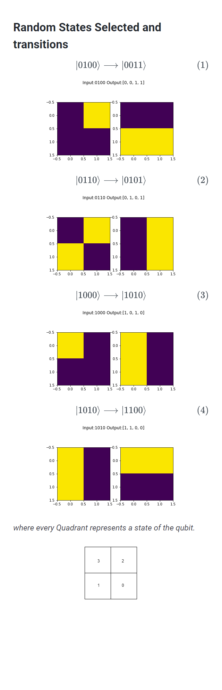

# QSOF Mentership Program
## Task 2


Prepare 4 random 4-qubit quantum states of your choice.

Create and train a variational circuit that transforms input states into predefined output states. Namely
- if random state 1 is provided, it returns state |0011>
- if random state 2 is provided, it returns state |0101>
- if random state 3 is provided, it returns state |1010>
- if random state 4 is provided, it returns state |1100>


<center>

</center>


What would happen if you provided a different state?


<hr>

## making things work
this project was done using pennylane. To run the code, you need to install pennylane.

### Windows
```powershell
python -m venv pennylane_env
.\pennylane_env\Scripts\activate
pip install pennylane
pip install jupyter
jupyter notebook QSOF.ipynb
```

### linux
```bash
python -m venv pennylane_env
source pennylane_env/bin/activate
pip install pennylane
pip install jupyter
jupyter notebook QSOF.ipynb
```

