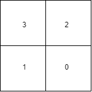

# QSOF Mentership Program
## Task 2

Prepare 4 random 4-qubit quantum states of your choice.

Create and train a variational circuit that transforms input states into predefined output states. Namely
- if random state 1 is provided, it returns state |0011>
- if random state 2 is provided, it returns state |0101>
- if random state 3 is provided, it returns state |1010>
- if random state 4 is provided, it returns state |1100>

## Random States Selected and transitions

$$ |0100\rangle \longrightarrow |0011\rangle $$

$$ |0110\rangle \longrightarrow |0101\rangle $$

$$ |1000\rangle \longrightarrow |1010\rangle $$

$$ |1010\rangle \longrightarrow |1100\rangle $$

*where every Quadrant represents a state of the qubit.*
 

 

What would happen if you provided a different state?
